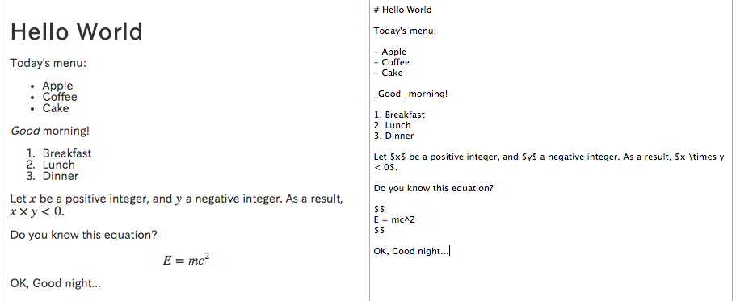

# mdpreview

[A demo page is here.](http://takuti.me/dev/mdpreview/)

You can preview Markdown with MathJax on your web browser. The left-side window is preview window, and the right-side one is input window (you can scroll).

## Features

- Realtime conversion from Markdown+MathJax code to HTML
- Synchronized scrolling
- Using LocalStorage to save input data

## Libraries

- MathJax
- markdown.js
- AngularJS
- jQuery

Running test was done on GoogleChrome only.
